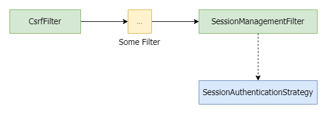

往往我們在 Spring Security 中要進行無狀態的服務撰寫時，將會設置 SessionCreationPolicy.STATELESS 使 Spring Security 不會產生 Session，然而在 Spring CSRF 防範的機制中，這樣的設定將會造成每個請求都會 Rotated CSRF Token。

## 問題

在應用當中，我們將會把 Csrf Token 放入 Cookie 並且在請求資源時，將 XSRF-Token 放入 Header 中，以達到 Double Submit 的目的。可是我們將會遇到一個問題，在大量請求下，可能在發後請求途中，被先前返回的請求更改 Csrf Token，當我們該次的請求將會出現 Csrf mismatch 的問題。

## 解決方案

這邊的解決方案，筆者查閱相關資訊，決定使用每一次登入只產生一次 Csrf Token 的思路來解決，這種思路我認為，若保持 SameSite 且 Origin 進行相關規範，以及強化 Csrf Token 的隨機性，應該還是有一定保護效果。

如果各位翻閱 CsrfFilter 以及 CsrfTokenRepository 可能會無法發現，每一次 Request 都進行 Rotated CSRF Token 的位置，其實這就要回到 Spring Security Filter Chain 的順序當中，當我們登入成功後，將會到 SessionManagementFilter 上，該 Filter 將會呼叫 SessionAuthebtiucationStrategy，而 CsrfAuthenticationStrategy 將會進行兩個動作，即為移除 Csrf Token 以及 刷新 Csrf Token。

所以我們將自定義 CsrfAuthenticationStrategy 來讓我們達到每一次登入僅產生一次 Csrf Token。



## CustomCsrfAuthenticationStrategy
```java
public class CustomCsrfAuehtenticationStrategy implements SessionAuthenticationStrategy {

	private final log logger = LogFactory.getLog(getClass());
    
    private final CsrfTokenRepository csrfTokenRepository;
    
    public CustomCsrfAuehtenticationStrategy(CsrfTokenRepository csrfTokenRepository) {
    	Assert.notNull(csrfTokenRepository, "csrfTokenRepository cannot be null");
    	this.csrfTokenRepository = csrfTokenRepository;
    }
    
    @Override
    public void onAuthentication(Authentication authentication, HttpServletRequest request, HttpServletReponse reponse) throws SessionAuthenticationException {
    	boolean containsToken = this.csrfTokenRepository.loadToken(request) != null;
        if(!containsToken && authentication.isAuthenticated()) {
        	csrfTokenRepository.saveToken(null, request, response);
            CsrfToken newToken = csrfTokenRepository.generateToken(request);
            csrfTokenRepository.saveToken(newToken, request, response);
            request.setAttribute(CsrfToken.class.getName(), newToken);
            request.setAttribute(newToken.getParameterName(), newToken);
            logger.debug("Replaced CSRF Token");
        }
    }
    
}
```

## SecurityConfig
```java
@Override
protected void configure(HttpSecurity http) throws Exception {
	http
    	.csrf()
        	.sessionAuthenticationStrategy(new CustomCsrfAuthenticationStrategy(getCsrfTokenRepository()))
    	...
}

private CsrfTokenRepository getCsrfTokenRepository() {
	CookieCsrfTokenRepository tokenRepository = CookieCsrfTokenRepository.withHttpOnlyFalse();
    tokenRepository.setCookiePath("/");
    return tokenRepository;
}
```

## 結論
筆者並不是所謂的資安專家，因此也無法證實這個解決方案是可行並且安全，全當一次紀錄。

## 參考
https://docs.spring.io/spring-security/site/docs/4.2.1.RELEASE/reference/htmlsingle/#filter-ordering
https://www.bennadel.com/blog/2991-cross-site-request-forgery-csrf-xsrf-race-condition-in-angularjs.htm
https://blog.nigelsim.org/2022-06-04-csrf-for-stateless-sso-apis/