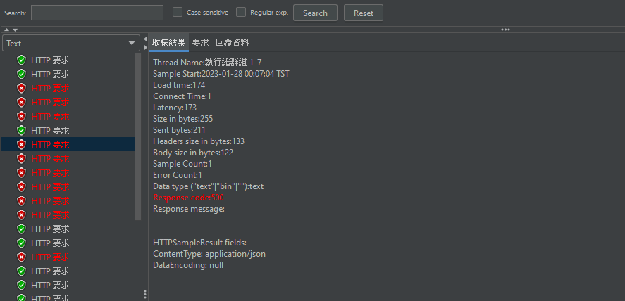
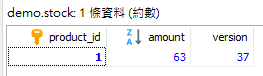

在上一篇我們談過了悲觀鎖的實際應用，與悲觀鎖不同的是，樂觀鎖並沒有對資料進行上鎖動作，我們允許同時進行對該筆的修改，也因此有可能造成資料不符合預期結果的問題產生。

## 樂觀鎖
**樂觀鎖(Optimistic Locking)**，相較於悲觀鎖，我們會認為資料更新並不頻繁，也因此允許同時對該筆資料進行多個動作，也代表我們其實並未針對該筆資料上鎖。在樂觀鎖上，我們會在 table 欄位上添加 version 欄位來進行更新的確認，在更新資料前我們會撈取該筆資料的 version 並且在更新時，利用這個 version 與 table 內目前的 version 進行比對，若相同則代表這段時間沒有人修改資料，可進行更新動作；反之代表有人比你早一步更新。

## 實戰
我們一樣使用悲觀鎖實戰中的資料表進行演練，表格內容如下。

| Column       | Type       | Primary Key   | 
| :----------: | :--------: | :-----------: |
| product_id   | INT        | YES           |
| amount       | INT        |               |
| version      | INT        |               |

### Spring Data JPA
在 Spring Data JPA 中我們可以在 Entity 中加入 **@Version** 來幫助我們進行樂觀鎖的實現。

#### Entity
```java
@Entity
@Table(name = "stock")
public class Stock {

	@Id
	@Column(name = "product_id")
	private int productId;

	@Column(name = "amount")
	private int amount;
	
	@Version
	@Column(name = "version")
	private int version;

	// getters and setters
}
```

#### Repository
```java
@Repository
public interface StockRepository extends JpaRepository<Stock, Integer> {

	@Query("SELECT s FROM Stock s WHERE s.productId = :productId")
	Optional<Stock> findByProductId(int productId);
	
}
```

#### Service
```java
@Service
public class StockServiceImpl implements StockService {

	private final StockRepository stockRepository;
	
	public StockServiceImpl(StockRepository stockRepository) {
		this.stockRepository = stockRepository;
	}
	
	@Transactional
	@Override
	public StockDto checkStock(int productId, int amount) {
		Optional<Stock> optional = stockRepository.findByProductId(productId);
		
		if(!optional.isPresent()) {
			throw new RuntimeException("product id not found, id: " + productId);
		}
		
		Stock stock = optional.get();
        
		int existAmount = stock.getAmount();
		stock.setAmount(existAmount - amount);

		stockRepository.save(stock);
		return convertToDto(stock);
	}
	
	private StockDto convertToDto(Stock stock) {
		StockDto stockDto = new StockDto();
		stockDto.setProductId(stock.getProductId());
		stockDto.setAmount(stock.getAmount());
		return stockDto;
	}
	
}
```

## 模擬測試
1. 庫存數量為 100
2. QPS 平均為 100/sec

### Test case


可以看到我們請求並不是很正常，讓我們接下去看看發生何種錯誤。

```
org.hibernate.StaleStateException: 
Batch update returned unexpected row count from update [0]; 
actual row count: 0; expected: 1; 
statement executed: update stock set amount=?, version=? where product_id=? and version=?
```

在錯誤訊息中，我們不難發現，更新失敗原因為 version 對應失敗，這也應證了我們一開始所說的樂觀鎖機制。

接下來讓我們看看資料表結果如何。



可以看到我們在 QPS 平均為 100/sec 的情況下，實際上只有扣除 37 份庫存，這也是樂觀鎖最直接的體現，在併發的時候結果不符合預期。

## 結論
從上述測試過程中，會覺得樂觀鎖資料不符合預期的狀況非常嚴重，但這種鎖定機制並非沒有用處，例如也許我們可以在更新用戶資料時使用該鎖，還是可以確保一定的資料正確性。

悲觀鎖與樂觀鎖的實際應用，並沒有強制的規定，我們應該要理解為何使用這種鎖，我們想要解決怎樣的問題。