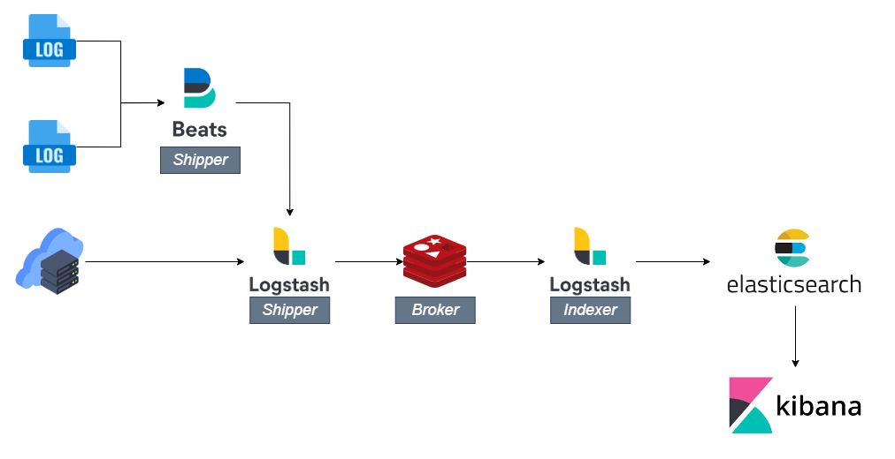

## 什麼是 ELK ?
ELK 是個縮寫，其描述由三個熱門專案所組成的堆疊，分別為 Elasticsearch、Logstash、Kibana，通常使用在彙總所有系統和服務的 Log 並且分析，也可建立系統監控架構，透過視覺化的呈現，讓我們可以快速了解系統狀況。

## 為何需要使用 ELK ?
隨著越來越多的系統慢慢走向雲端、微服務，在 infra 角度，我們不可能在每一台主機進行 Log 檢視與錯誤排查，所以我們需要一個日誌管理與分析的平台，來讓我們監控基礎設施、服務日誌、系統流量等資訊，以達到故障診斷、快速排查相關系統問題。

## 要不要來點 ELK ?
接下來就讓我們以一個最基礎的 ELK 服務進行測試，我們先來讀讀架構圖。

在這邊基本上大家可以注意 Shipper、Broker、Indexer 這三種類型，其工作分別為以下:

### Shipper
* Filebat: 主要負責搬運如 nginx、apache 等日誌。
* Logstash: 接收 Filebeat 來的日誌或者其他來源。

### Broker
* Redis: 緩存主要拿來防止 Logstash 故障問題，我們可以暫時儲存資料，直至 Logstash 恢復。

### Indexer
* Logstash: 在這邊我們將使用 Logstash 做一個過濾器，將消息切割成不同欄位，讓後續操作 Elasticsearch 時可以輕鬆的查詢。

## 結論
至此我們完成了 ELK 初步了解與規劃，後續文章我們將探討如何使用 Docker 完成 ELK 設施建構，有興趣的夥伴不妨可以停下腳步，跟我們一起實戰吧!