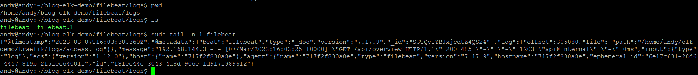

## 什麼是 Filebeat ?
如果我們去 Filebeat 介紹頁面，會看看斗大的 Lightweight shipper for logs 字眼，意思就是說 Filebeat 是一個輕量日誌採集器，其主要工作就是幫助我們進行日誌收集，下面讓我們看看有那些特色。

* 輕量日誌採集器，設定方式簡潔。
* 提供許多模組可快速接收與解析日誌，如 Traefik、Nginx、MySQL 等。
* Filebeat 有自己的 Registry 文件，不會因為系統重啟而重複發送日誌。
* 若連接一方為 Logstash 或者 Elasticsearch 時，會自動檢視對方是否過載，若過載將降低傳輸速度，直到系統恢復正常。

我們簡單的介紹過 Filebeat 之後，接下來讓我們利用 Docker 來體驗一下它的魔力。

## Say hello to Traefik
Traefik 與 Nginx 一樣，都是一套反向代理工具，今天我們就不多做介紹(其實我有點懶)，直接開玩。

### Step 1. Edit traefik.yml
```yaml
## traefik.yml

# Docker configuration backend
providers:
  docker:
    defaultRule: "Host(`{{ trimPrefix `/` .Name }}.docker.localhost`)"

# API and dashboard configuration
api:
  insecure: true

# Enable access log
accessLog:
  filePath: "/etc/traefik/logs/access.log"
```

### Step 2. Run traefik
```bash
docker run -d -p 8080:8080 -p 80:80 \
-v $PWD/traefik.yml:/etc/traefik/traefik.yml \
-v $PWD/logs:/etc/traefik/logs \
-v /var/run/docker.sock:/var/run/docker.sock \
traefik:v2.5
```

沒意外大家現在已經可以訪問 http://localhost:8080 了，接下來讓我們嘗試使用 Filebeat 進行資料存取測試。

## Hi, Filebeat
接下來我們來看看 Filebeat 基礎服務如何實現。

### Step 1. Edit filebeat.yml
```yaml
## filebeat.yml
filebeat.inputs:
  - type: log
    enabled: true
    paths: ["/home/andy/elk-demo/traefik/logs/access.log*"]

processors:
  - add_id: ~

output.file:
  enabled: true
  codec.json:
    pretty: false
  path: "/tmp/filebeat/"
  filename: filebeat
  rotate_every_kb: 10000
  permissions: 1001
```

Filebeat 有許多設定方式，其中不乏與優化息息相關，但目前我們尚不需要得知，不過建議同學玩過一輪後，拜讀一下 [Filebeat 應該要了解的設計細節與原理](https://ithelp.ithome.com.tw/articles/10274944)，裡面有更多詳細的解答。

* inputs: 我們將在這邊告知 Filebeat 要抓的類型、是否啟動、以及檔案路徑。
* processors: 在資料往後送之前，會做一些簡單加工，通常我們會使用其他進行去重複的動作，在這邊因為內容資料並無法讓我們使用其內容產生 ID，所以我們使用 add_id: ~ 來讓 Filebeat 自動產生 ID。
* output: 在 Filebeat 提供許多 Output 方式，例如 Logstash、Elasticsearch、Redis、Kafka 等，但本次我們只想要證明 Filebeat 是否有撈取資料，因此僅使用 File 來輸出。

### Step 2. Run filebeat
```bash
docker run -d \
-v $PWD/filebeat.yml:/usr/share/filebeat/filebeat.yml:ro \
-v /home/andy/elk-demo/traefik/logs:/home/andy/elk-demo/traefik/logs:ro \
-v /home/andy/blog-elk-demo/filebeat/logs:/tmp/filebeat \
--user rootls
elastic/filebeat:7.17.9 \
-e --strict.perms=false
```

## Testing
來讓我們測試一下，Filebeat 是否開始如願擷取我們的 access.log 呢?

按照我們 Volume 所設定，在我們的 /home/andy/blog-elk-demo/filebeat/logs 應該要與 Filebeat 所產生檔案的路徑進行關聯。

```bash
cd /home/andy/blog-elk-demo/filebeat/logs
ls
# filebeat filebeat.1
```

沒意外我們會看到 filebeat 的檔案，這時候我們嘗試打開檔案會如下圖中顯示。



## 結論
目前使用至此，Filebeat 的設定並不困難，若是服務不大的情況，基本上可以說開箱即用了，當然安全一點還是得去了解 Filebeat 相關機制，才可以設計出合適的設定。

在下一篇中，我們將開始整合 Redis 與 Logstash 讓我們的日誌能到緩存至 Broker。

## 參考
https://www.elastic.co/beats/filebeat</br>
https://ithelp.ithome.com.tw/articles/10274944