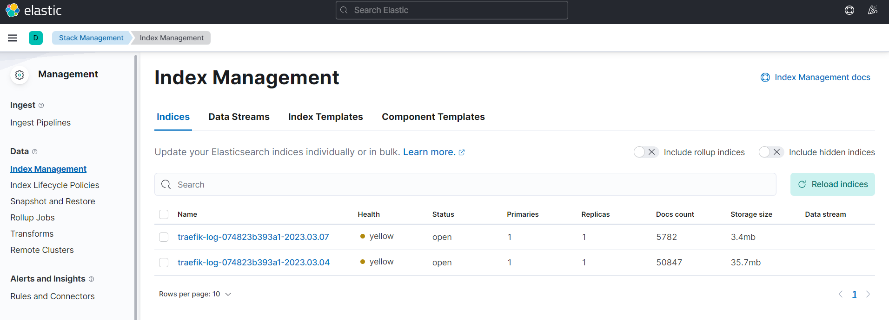
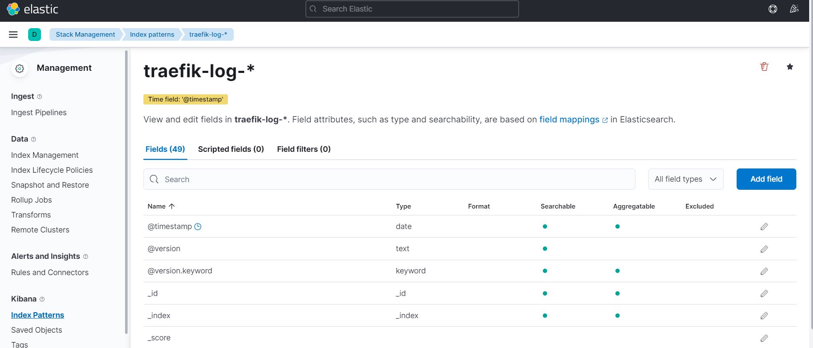
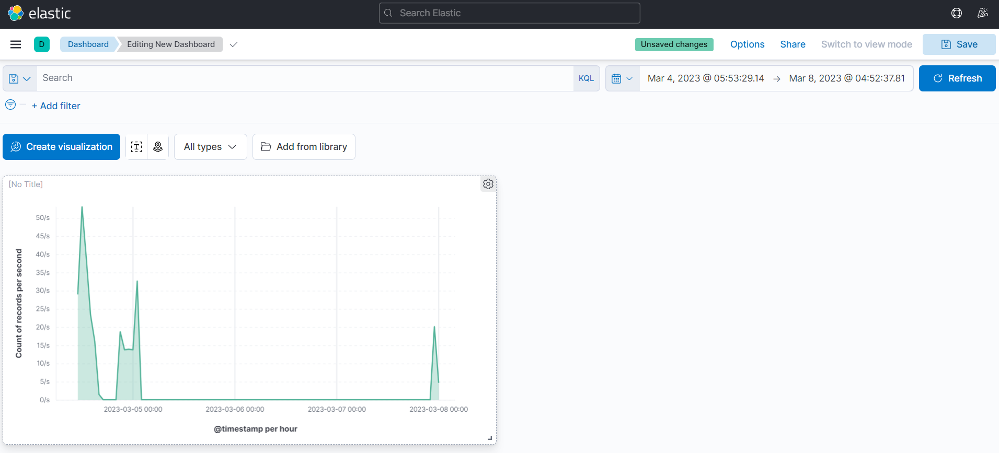

* Git項目位置: https://github.com/Kuan-Wei-Kuo/elk-demo

## 什麼是 Kinaba ?
Kinana 簡單的說就是一到視覺化工具，但其中還新增了許多與 Elasticsearch 進行設定的功能，來方便我們對 ES 進行操作。

## 出來吧 ! Kibana
話說在上一章節，我們已經將 Filebeat、ES、Logstash 啟動完畢，ES 中也開始存儲資料了，接下來就讓我們從 Kibana 上進行展示。

### Edit yaml configuration
```yaml
## kibana.yml
server.host: "0.0.0.0"
server.port: "5601"
server.name: "kibana"
elasticsearch.hosts: ["http://192.168.144.5:9200/"]
xpack:
  apm.ui.enabled: false
  graph.enabled: false
  ml.enabled: false
  monitoring.enabled: false
  reporting.enabled: false
  security.enabled: false
  grokdebugger.enabled: false
  searchprofiler.enabled: false
```

### Run kibana
```bash
docker run -d \
-p 5601:5601 \
-v $PWD/kibana.yml:/usr/share/kibana/config/kibana.yml:ro \
kibana:7.17.9
```

### Find indices
接下來我們連接到 http://localohsot:5601 嘗試尋找我們的 traefik-log 位置。

1. 第一次進入 Kibana 時會出現 Start by adding integrations 建議，這邊我們選擇 Explore on my own。
2. 點選左上角的側拉選單，從選單中選擇 Stack management。
3. 進入 Management 後，我們選擇 Index Management。
4. 檢視是否有 traefik 相關 index，理論上我們會看到如檢核點中的畫面。

#### 檢核點


### Create index patterns
我們已經確定有資料了，接下來就是要建立 Index Pattern 方便讓 Kibana 進行使用。

1. 讓我們再度回到 Stack Management 中。
2. 選擇 Index Pattern，並且 Create index pattern。
3. Name 輸入 traefik-log-*，這個 Pattern 就可以索取 Prefix 為 traefik-log 的 Index。
4. Timestamp field 選擇 @timestamp。
5. 點選 Create index pattern。

#### 檢核點


### Create dashboard
到最後，我們可以開始建立簡單的圖表資訊了，讓我們利用這個 index pattern 來建立吧 !

1. 點擊左上角的側拉選單，從選單中選擇 Dashboard。
2. 點擊 Create new dashboard 並且進入畫面。
3. 點擊左方的 Create visualization。
4. 使用以下表格輸入相關參數。

| 項目 | 內容 |
|-----|-----|
| Index pattern | traefik-log-* |
| Layer visualization type | Area |
| Horizontal axis | @timestamp |
| Vertical axis | Select "Count" function |
| Vertical axis | Select "Record" field |

5. 點擊右上方的 Save and return。
6. 我們可以檢視到 traefik 的流量統計圖了。

#### 檢核點


## 結論
終於到了終章，在此次的系列文章中，我們非常簡易的跑過一次 ELK 相關流程，在這邊還是得叮嚀一下，記得要因應需求來進行變更，我們此次文章僅僅是 Demo 型態。