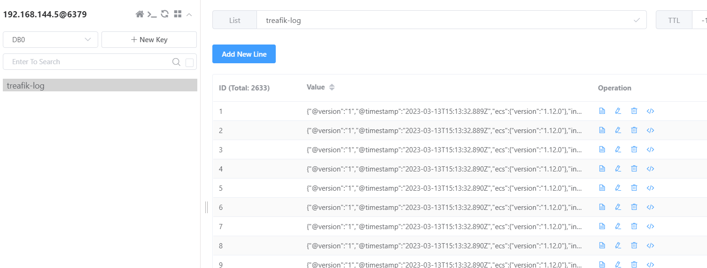

## 什麼是 Logstash ?
Logstash 是一個資料處理管道，其從多個來源攝取資料以及轉換，後續將會傳送資料至我們喜歡的存儲位置。

從上述我們也可以切分成三塊，正好是 Logstash 的主要組成，分別為以下:
* Input: 主要負責接收數據，例如從 Filebeat、網路等輸入，其提供的來源真不少，建議大家在建立 Input 時可以去官網看看。
* Filter: 其用途主要用於解析、轉換、過濾等功能。
* Output: 輸出模組主要用於將結果輸出到其他系統或者應用程式中，例如資料庫、搜尋引擎、MessageQueue 等。

以上就是 Logstash 的簡介，接下來我們來體驗看看，如何將上篇文章中的 Filebeat 進行結合，並且將資料輸出到 Redis 中。

## 搞一下 Redis
此次 Redis 作為 ELK 架構中的 Broker，其主要負責緩存資料，避免上下層關係出錯後，導致資料消失。

### Run redis
```bash
sudo docker run -d \
-p 6379:6379 \
redis
```

提醒一下，我們 redis 基本上就是預設，在 docker 裡甚至我們沒有處理相關安全性設定，因此記得不要直接這樣上到正式環境。

## 看看 Logstash
我們有 Filebeat 也有 Redis 了，接下來我們將 Logstash 當作一個 Shipper 角色，來幫助我們將資料傳遞至 Redis。

### Step 1. Edit pipeline configuration
```bash
mkdir -p ./logstash/pipeline
cd ./logstash/pipeline
vi traefik-shipper-pipeline.config
```

這邊我們簡單的說明一下步驟: </br>
    1. 建立 logstash 與 logstash/pipeline 資料夾，並且進入其中。</br>
    2. 編輯 traefik-shipper-pipeline.config 檔案，如下設定。

```conf
## traefik-shipper-pipeline.config
input {
  beats {
    port => "5000"
  }
}

output {
  redis {
    data_type => "list"
	key => "treafik-log"
	host => "192.168.144.5"
	port => "6379"
  }
}
```

這個設定檔非常的簡單，讓我來稍微說明:</br>
    1. 建立一個 beats input，監聽在 Port-5000。</br>
    2. 不進行 Filter，直接將 Output 指向 Redis 裡，並且 Key 為 traefik-log。

### Step 2. Edit filebeat.yml
```yaml
## filebeat.yml
filebeat.inputs:
  - type: log
    enabled: true
    paths: ["/home/andy/elk-demo/traefik/logs/access.log*"]

processors:
  - add_id: ~

output.logstash:
  hosts: ["192.168.144.5:5000"]
```

在上一篇文章中，我們 Filebeat 設定輸出至檔案中，這次我們將要正式輸出到 Logstash 上，因此需要修改 Output 位置。

### Step 3. Run logstash
```bash
sudo docker run -d -p 5000:5000 \
-v $PWD/pipeline:/usr/share/logstash/pipeline:ro \
logstash:7.17.9
```

## 驗證


我們接下來登入 Redis manager 即可看到 traefik-log key 以及其內部資料，這也代表說我們的設定成功了。

## 結論
其實大家可以看到目前設定很簡單，因為此次設定僅僅是想讓 Filebeat 過一下 Logstash 罷了，其實 Filebeat 可以直接傳送資料至 Redis。因此在正式環境時，大家還是得按照業務情境進行設計，會有比較好的結果。

在下一篇張，我們將嘗試進行 Logstash indexer 與 Elasticsearch 以及 Kibina 的互動，讓我們結束此次 ELK 體驗之旅吧!

## 參考
https://chat.openai.com/chat</br>
https://www.elastic.co/logstash/