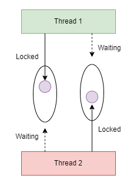

## 如何造成死鎖
基本上要造成死鎖的條件有四個，如下說明

* 禁止搶占: 已經分配的資源不能被強制性釋放。
* 持有與等待: 執行緒已經持有了至少一個資源，並且正在等待獲取其他資源。
* 互斥: 至少有一個資源被設置成了互斥狀態，即一次只能由一個執行緒訪問。
* 循環等待: 存在一個等待循環，即執行緒A正在等待執行緒B持有的資源，執行緒B正在等待執行緒C持有的資源，而執行緒C正在等待執行緒A持有的資源。

讓我們用一張圖來看看



圖中其實我們最簡單的可以看到循環等待的事情發生，接下來除了這條件外，我們利用物件鎖來嘗試完成這次的死鎖。

### 造成死鎖看看
```java
public class Example01 {
    
    private static final Object objLock1 = new Object();

    private static final Object objLock2 = new Object();

    public static void main(String[] args) throws InterruptedException {
        Thread t1 = new Thread(() -> {
            synchronized(objLock1) {
                System.out.println(Thread.currentThread().getName() + "Locked 1");
                synchronized(objLock2) {
                    System.out.println(Thread.currentThread().getName() + "Locked 2");
                }
            }
        });

        Thread t2 = new Thread(() -> {
            synchronized(objLock2) {
                System.out.println(Thread.currentThread().getName() + "Locked 2");
                synchronized(objLock1) {
                    System.out.println(Thread.currentThread().getName() + "Locked 1");
                }
            }
        });

        t1.start();
        t2.start();
        t1.join();
        t2.join();
    }

}
```

當大家執行上述程式碼時，我們完成了造成死鎖的四個條件，也確實成功產生死鎖，並且只能強制程式退出運行。

### 解除死鎖
如果說造成死鎖的原因，是得滿足上述的四個條件，那假設我們來破壞這四個條件其中之一看看呢? 大概想法為以下:

* 避免循環等待
* 避免巢狀鎖

```java
public class Example02 {
    
    private static final Object objLock1 = new Object();

    private static final Object objLock2 = new Object();

    public static void main(String[] args) throws InterruptedException {
        Thread t1 = new Thread(() -> {
            synchronized(objLock1) {
                System.out.println(Thread.currentThread().getName() + "Locked 1");
            }
            synchronized(objLock2) {
                System.out.println(Thread.currentThread().getName() + "Locked 2");
            }
        });

        Thread t2 = new Thread(() -> {
            synchronized(objLock2) {
                System.out.println(Thread.currentThread().getName() + "Locked 2");
                synchronized(objLock1) {
                    System.out.println(Thread.currentThread().getName() + "Locked 1");
                }
            }
        });

        t1.start();
        t2.start();
        t1.join();
        t2.join();
    }

}
```

在上面我們將第一個 Thraed 的鎖改成非巢狀鎖並且解除循環等待，但我們第二個 Thread 保持在舊有方式，在這邊我們可以看到程式碼會正常運行，並且沒有死鎖問題，這是因為我們兩個 Thread 的競爭狀況已經被我們破壞。

## 結論
這次我們成功使用四個條件造成死鎖，鎖在併發情形下是非常重要的，做得好帶來效能，反之，若今天我們對鎖並沒有好好的編排與設計，帶來的絕對是災難。

## 參考
https://chat.openai.com/chat<br>
https://medium.com/bucketing/java-concurrency-3-%E6%AD%BB%E9%8E%96-deadlock-ec82e01822f6<br>
https://www.developer.com/java/java-prevent-thread-deadlock