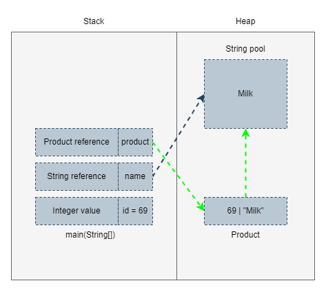

在 JAVA 中管理記憶管理分為兩部分，分別為 Stack 與 Heap，各自有著不同的負責項目，也需要相互合作，接下來就讓我們探討兩者之前的差別。

## Stack Memory
在 JVM 中 Stack 儲存順序為後進先出(LIFO)，每個 thraed 都維護著自有的 Stack 區塊，其負責儲存變數、物件參照、函式等等。

現在我們來說說函式，每當我們調用一個函式時，都將在 Stack 中建立一個區塊，此區塊負責儲存上述所說明的項目，然而分配的記憶體會一直存在，直到函式完成執行。倘若函式一直無法返回結果，記憶體用量無限增生，此時就會發出 StackOverFlowError，這也是在撰寫遞迴時常看見的錯誤訊息。

## Heap Memory
說到 Heap 就不得不說 OutOfMemoryError，這也是我們常常遇到的錯誤訊息，也因為 Heap 主要負責儲存物件以及 JRE 相關類別，因此設計大量資料運算時，常常我們需要考慮記憶體用量，並且使用批次進行計算，盡量讓物件達成 GC 回收的前置作業，以免發生 OOM 錯誤。

而開頭說明 Stack 與 Heap 會互相合作，其實就是由 Stack 負責儲存物件參照位置，Heap 負責使用參照位置進行儲存物件資料，由 JVM 自行管理其運作關係。

## 範例
接下來我們簡單的設計一個範例，基本上就是從 main 方法中進行 Product 物件的建立。

```java
class Product {
    int id;
    String name;

    public Product(int id, String name) {
        this.id = id;
        this.name = name;
    }
}

public static void main(String[] args) {
    int id = 69;
    String name = "Milk";

    Product product = new Product(id, namn);
}
```
讓我們一步步地分析:
1. main() 函式被調用，將在 Stack 分配區塊進行儲存該方法與相關變數。
2. Stack 直接儲入整數 id 的原始值。
3. Heap 分配 String pool 區塊，將字串 name 進行儲存，並且 Stack 儲存其參照位置。 
4. 從 main() 函式調用 Product(int, String)， Heap 將儲存 Stack 中的 id 與 name，最終創立 Prodcut 類別並由 Stack 儲存其參照位置。 



## 參考
https://www.javatpoint.com/stack-vs-heap-java
https://www.baeldung.com/java-stack-heap
https://stackify.com/java-heap-vs-stack/