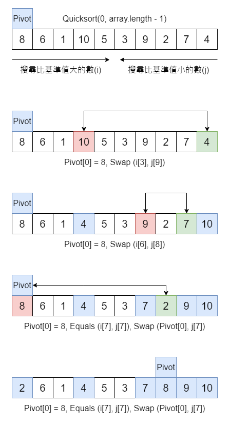

基本上 Quicksort 使用 Divide and conquer 策略，將一個 List 進行切割為兩個子序列，只要我們不斷地遞迴這兩個子序列，我們就能夠快速的排序。

## 步驟
1. 挑選從數列中挑選基準值 (Pivot)，並沒有限制基準值需要從哪個地方開始
2. 分割子序列，所有比基準值小的元素將擺放在基準值前面，比基準值大的元素將擺在後面。基本上該動作完成後，我們會得到兩個子序列
3. 遞迴子序列，基於小於基準值子序列和大於基準值子序列進行排序

## 圖解



最終我們將會得到小於基準值子序列和大於基準值子序列<br>
小於基準值子序列 2, 6, 1, 4, 5, 3, 7<br>
大於基準值子序列 9, 10<br>
接下來我們將針對這兩個數列，持續地遞迴，即可達到我們想要的排序結果

## 程式碼
```java
public class Solution {
	
	public void swap(int[] arr, int i, int j) {
		int temp = arr[j];
		arr[j] = arr[i];
		arr[i] = temp;
	}

	public void quickSort(int[] arr, int left, int right) {
		if(left >= right) {
			return;
		}
		
		// 基準值, 通常從陣列第一個數開始
		int pivot = arr[left];
		
		// 暫存左右搜索狀態, 基準值不動，因此 i+=1
		int i = left + 1;
		int j = right;
		
		while(true) {
			// 往右邊搜索, 直到找到大於基準值的數
			while(i <= j && arr[i] < pivot) {
				i++;
			}
			
			// 往左邊搜索, 直到找到小於基準值的數
			while(i <= j && arr[j] > pivot) {
				j--;
			}

			// 若 i 大於等於 j 時, 代表分割子序列完畢
			if(i >= j) {
				break;
			}
			
			swap(arr, i, j);
		}
		
		// 分割結束
		swap(arr, left, j);
		
		// 針對兩個子序列進行遞迴
		quickSort(arr, left, j - 1);
		quickSort(arr, j + 1, right);
	}
	
	public static void main(String[] args) {
		int[] arr = new int[] {8,6,1,10,5,3,9,2,7,4};
		
		Solution solution = new Solution();
		solution.quickSort(arr, 0, arr.length - 1);
	}
	
}
```

## 參考
https://zh.m.wikipedia.org/zh-tw/%E5%BF%AB%E9%80%9F%E6%8E%92%E5%BA%8F