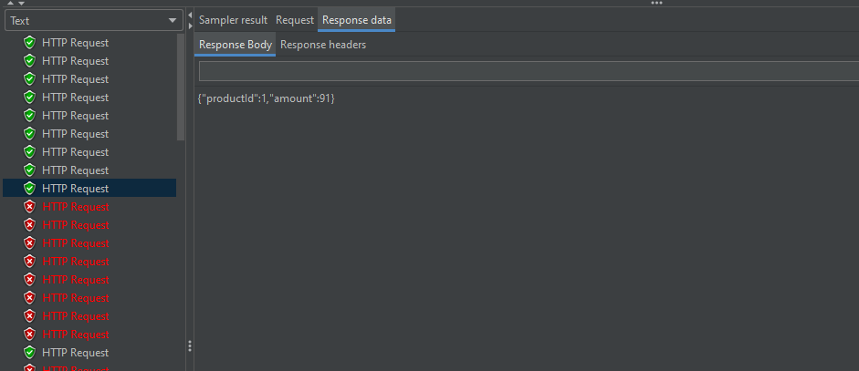
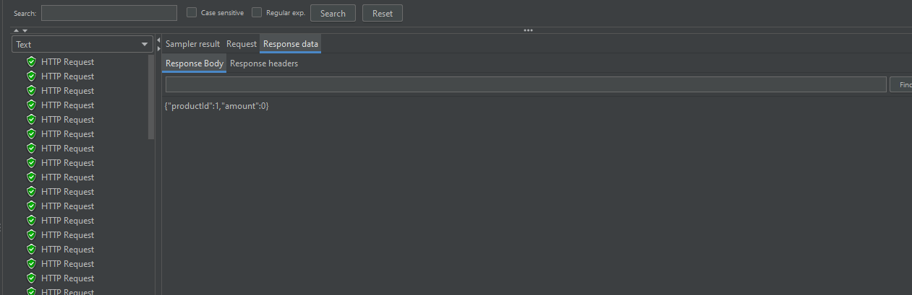
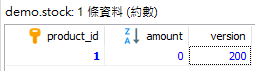

# 淺談悲觀鎖與實戰
在大量請求下，在業務上容易發生併發情況，如果不好好保持資料原子性，那麼我們的資料最終結果並不可信，可以想像若在與金流相關系統上發生這種問題，這將是個災難。其實說白了，就是要避免**競爭條件(Race condition)**。

## 悲觀鎖
**悲觀鎖(Pessimistic Locking)**，悲觀點在於每次都認為資料並不安全，資料更新需求非常高，因此我們要在每次拿數據時都上鎖，在這期間其他請求將會 **Block** 直至放鎖，等待下一個請求進行上鎖。從上述的描述，其實我們不難發現 Java 中的 **Synchronized** 就屬於悲觀鎖的實現，甚至資料庫許多鎖表機制也是屬於悲觀鎖。

## 實戰
在傳統 RDB 上，我們可使用 SELECT ... FOR UPDATE 來針對 ROW 進行上鎖，直到後續 Commit 後才進行放鎖動作。

假設現在我們有一個庫存資料表，表格內容如下。

| Column     | Type     | Primary Key |
| ---------- | -------- | ----------- |
| product_id | INT      | YES         |
| amount     | INT      |             |
| version    | INT      |             |

### Spring Data JPA
在 Spring Data JPA 中我們可以更加優雅的使用 **@Lock** 來幫助我們進行悲觀鎖的實現。

#### Entity
```java
@Entity
@Table(name = "stock")
public class Stock {

	@Id
	@Column(name = "product_id")
	private int productId;

	@Column(name = "amount")
	private int amount;
	
	@Column(name = "version")
	private int version;

	// getters and setters
}
```

#### Repository
```java
@Repository
public interface StockRepository extends JpaRepository<Stock, Integer> {

    @Lock(value = LockModeType.PESSIMISTIC_WRITE)
	@Query("SELECT s FROM Stock s WHERE s.productId = :productId")
	Optional<Stock> findByProductId(int productId);
	
}
```

#### Service
```java
@Service
public class StockServiceImpl implements StockService {

	private final StockRepository stockRepository;
	
	public StockServiceImpl(StockRepository stockRepository) {
		this.stockRepository = stockRepository;
	}
	
	@Transactional
	@Override
	public StockDto checkStock(int productId, int amount) {
		Optional<Stock> optional = stockRepository.findByProductId(productId);
		
		if(!optional.isPresent()) {
			throw new RuntimeException("product id not found, id: " + productId);
		}
		
		Stock stock = optional.get();
        
		int existAmount = stock.getAmount();
		int existVersion = stock.getVersion();
        
		if(existAmount >= amount) {
			stock.setAmount(existAmount - amount);
		}
		stock.setVersion(existVersion + 1);
		stockRepository.save(stock);
		return convertToDto(stock);
	}
	
	private StockDto convertToDto(Stock stock) {
		StockDto stockDto = new StockDto();
		stockDto.setProductId(stock.getProductId());
		stockDto.setAmount(stock.getAmount());
		return stockDto;
	}
	
}
```

## 模擬測試
1. 庫存數量為 100
2. QPS 平均為 100/sec

### Test case 1
如上述條件為基礎下，我們將在 **stockRepository.save** 之前將 **Thread.sleep(3 * 1000L)**。在這個測試情結下，我們可以測試在併發時，是否有真的進行上鎖動作。



可以看到在前面幾個的 Request 都已經完成，但後續的 Request 很大概率會因為 Connection Timeout 機制導致出錯，這也根本上的代表我們確實將該筆資料進行上鎖了。

### Test case 2
一樣在上述的基礎下，我們這次將移除 **Thread.sleep(3 * 1000L)** 並且觀察庫存是否有超賣問題。



這次可以看到我們請求都正常了，該檢視一下庫存是否超賣了。



在上圖中我們可以發現，**version** 為 **200**，證明了我們確實都完成了請求，然而在 QPS 平均為 100 的情況下，我們也 **amount** 也沒有發生超賣情形。

## 結論
在實現悲觀鎖的過程中，我們不難發現，在這種誰先取得 Lock 誰先動作的過程，其實也是確保了執行的順序。

大家不妨使用 Java Synchronized 來進行 Multi-thread 程式撰寫，其實也是相同道理，都是要處理競爭條件的。