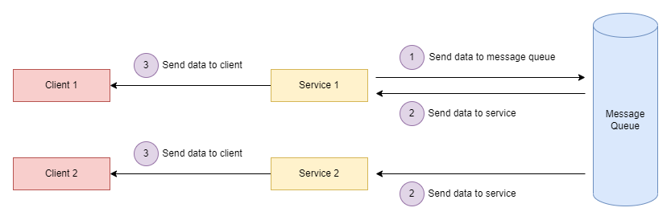
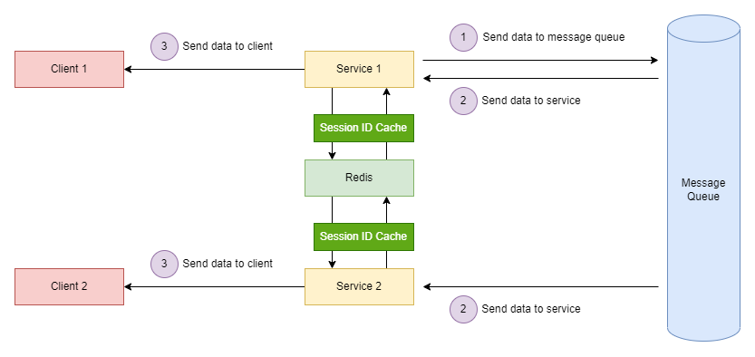

## 前提
現代系統搭配負載均衡的服務越來越多，如果服務需要搭配 Websocket 功能，每個服務訂閱的真實位置可能都不同，那麼我們如何共享服務的消息。

## 解決思路
假設我們今天有一個廣告服務，廣告成立後要使用 Websocket 通知各個 Client 端，而廣告服務又被 Replicas 多個。按照上述場景，我們是無法得知 Client 訂閱了哪一個服務，除非我們後端成功建立常連接後進行 IP、Session 的緩存，才能夠得知 Client 真實訂閱哪個服務。

> 1. 廣播群體使用者

整體來說我們可將所有要廣播的消息丟到 MQ 裡，這時候我們可以選擇 Client 是否直接要訂閱 MQ，又或者想將 MQ 隱藏起來，由服務在接收一次 MQ 資料，進行 Websocket 廣播，流程圖如下。

> 2. 廣播個別使用者

思路大體上是一樣的，只是這時候我們需要儲存同個 User 不同裝置的 Session ID，並且利用 Spring websocket 中的 setUserDestinationPrefix、convertAndSendToUser 來幫助我們廣播到個別使用者身上。

## 結論
除了這次分享的方式除外，我們還可以使用Redis、Database 都可以實現這種效果。當然這次的分享還是簡單了，但安迪我也不愛寫太長的文章，又臭又長，寫了也是挺累了。